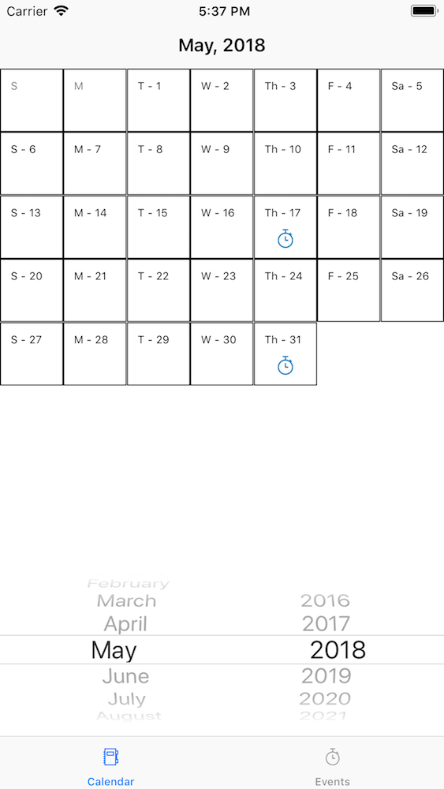
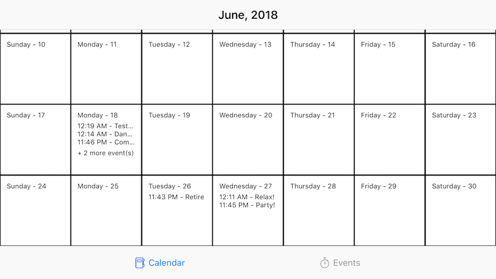
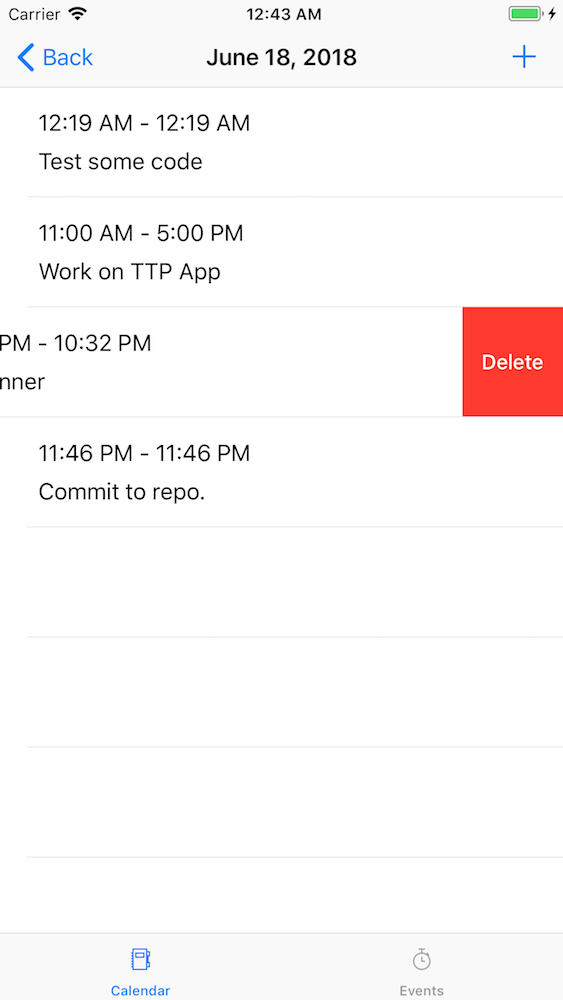
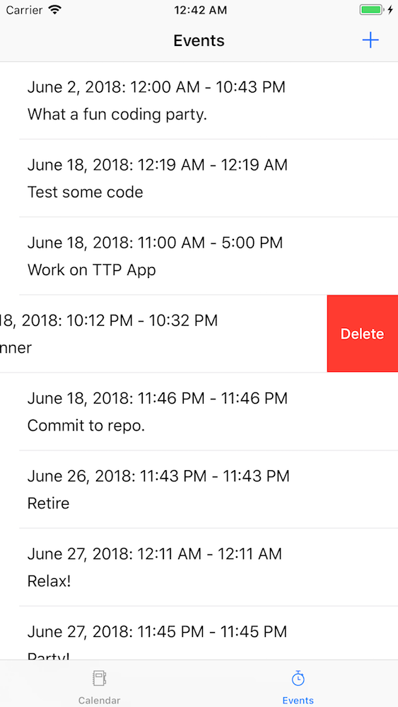
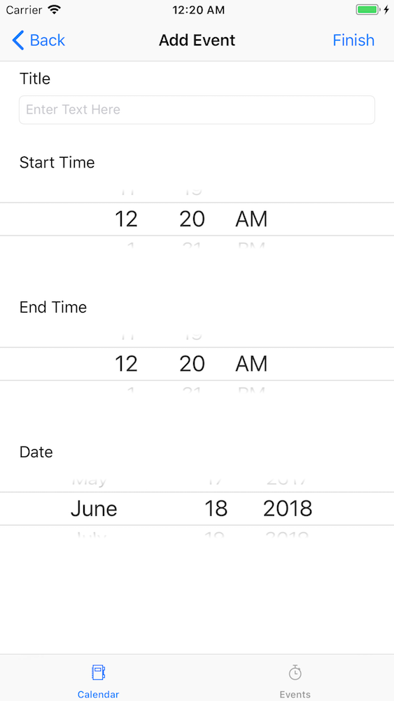

# TTP Spotify Calendar

Another year, another TTP project!

## Run

Open `~/CalendarFrontEnd/CalendarFrontEnd.xcodeproj` and run the project.

## Screens

Main View | Landscape with preview text
--- | ---
 | 

Date View with Delete | All Events with Delete | Create / Edit Screen
--- | --- | ---
 |  | 

## Backend

Made with Heroku with Node and MongoDB. Deployed at [https://warm-shore-97050.herokuapp.com/api/events/](https://warm-shore-97050.herokuapp.com/api/events/)